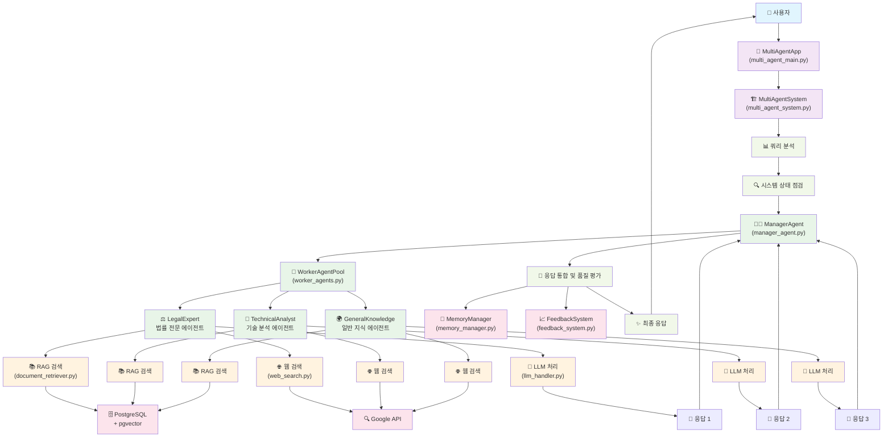

# 🤖 AI 멀티 에이전트 시스템

3개의 전문 에이전트와 1개의 관리자 에이전트로 구성된 고도화된 AI 시스템입니다.

## 🏗️ 시스템 아키텍처



## 📋 시스템 구성

### 🎯 관리자 에이전트 (1개)
- **역할**: 워커 에이전트들의 결과를 분석하고 최적의 답변 생성
- **기능**: 품질 평가, 일관성 검증, 응답 통합

### 🔧 워커 에이전트 (3개)
1. **법률 전문 에이전트** - 금융법, 소비자보호법 전문
2. **기술 분석 에이전트** - 시스템 아키텍처, 개발 전문  
3. **일반 지식 에이전트** - 폭넓은 지식 기반 응답

## 🚀 주요 기능

- ✅ **멀티 에이전트 협업**: 3개 에이전트가 동시에 응답 생성
- ✅ **웹 검색 + RAG**: 최신 정보와 문서 검색 결합
- ✅ **메모리 관리**: 단기/장기 메모리로 학습 능력
- ✅ **자기 수정**: 피드백 기반 성능 개선
- ✅ **품질 보장**: 품질 등급과 일관성 검증

## 📁 파일 구조

```
📦 프로젝트
├── 🎯 multi_agent_main.py      # 메인 애플리케이션
├── 🤖 multi_agent_system.py    # 시스템 오케스트레이터
├── 👔 manager_agent.py         # 관리자 에이전트
├── 👷 worker_agents.py         # 워커 에이전트들
├── 🧠 memory_manager.py        # 메모리 관리
├── 🔄 feedback_system.py       # 피드백 시스템
├── 🔗 llm_handler.py          # LLM 핸들러
├── 🔍 web_search.py           # 웹 검색
├── 📚 document_retriever.py    # 문서 검색 (RAG)
├── 📄 pdf_to_db.py            # PDF 문서 처리
├── ⚙️ config.py              # 설정 파일
└── 📦 requirements.txt        # 필요 패키지
```

## 🛠️ 설치 및 설정

### 1. 패키지 설치
```bash
pip install -r requirements.txt
```

### 2. 환경 변수 설정 (.env 파일 생성)
```env
# LLM API 키
GROQ_API_KEY=your_groq_api_key_here

# 웹 검색 (선택사항)
GOOGLE_API_KEY=your_google_api_key_here
SEARCH_ENGINE_ID=your_search_engine_id_here

# 데이터베이스 (기본값 사용 가능)
DB_NAME=financedb
DB_USER=sangmin
DB_PASSWORD=0717
DB_HOST=localhost
DB_PORT=5432
```

### 3. 데이터베이스 설정 (선택사항)
- PostgreSQL + pgvector 설치
- PDF 문서를 `laws_pdfs/` 폴더에 저장
- `python pdf_to_db.py` 실행하여 문서 임베딩

## 🎮 사용법

### 기본 실행
```bash
python multi_agent_main.py
```

### 실행 모드 선택
1. **대화형 모드** (기본) - 질문하고 답변 받기
2. **데모 모드** - 미리 정의된 질문으로 테스트
3. **배치 테스트** - 여러 질문 동시 처리
4. **시스템 상태** - 성능 및 상태 확인

### 명령어
- `help`: 도움말 표시
- `status`: 시스템 상태 확인
- `reset`: 시스템 리셋
- `exit` / `quit`: 종료

## 💡 사용 예시

### 법률 질문
```
질문: 금융소비자보호법 제20조란 무엇인가요?
→ 법률 전문 에이전트가 주도하여 정확한 법조문 제공
```

### 기술 질문
```
질문: 멀티 에이전트 시스템은 어떻게 구현하나요?
→ 기술 분석 에이전트가 아키텍처와 구현 방법 설명
```

### 일반 질문
```
질문: 최신 AI 기술 동향은?
→ 일반 지식 에이전트가 폭넓은 정보 제공
```

## 📊 품질 지표

각 응답에는 다음 정보가 제공됩니다:

- **품질 등급**: EXCELLENT / GOOD / FAIR / POOR
- **일관성 점수**: 에이전트 간 합의 수준
- **참여 에이전트**: 답변에 기여한 에이전트들
- **소스 정보**: 참조한 문서 및 웹 자료
- **추천 사항**: 더 나은 질문을 위한 제안

## 🔧 커스터마이징

### 새로운 에이전트 추가
1. `worker_agents.py`에서 `BaseWorkerAgent` 상속
2. `_get_specialized_prompt()` 메서드 구현
3. `WorkerAgentPool`에 에이전트 추가

### 품질 기준 조정
`manager_agent.py`의 `quality_thresholds` 값 수정

### 메모리 설정 변경
`memory_manager.py`의 `max_short_term_size` 및 DB 설정 조정

## 🚨 문제 해결

### API 키 없음
- 웹 검색 API 키가 없어도 기본 동작 가능
- 더미 결과로 대체되어 시스템 계속 작동

### 데이터베이스 연결 실패
- 문서 검색 없이도 웹 검색으로 동작 가능
- PostgreSQL 설치 후 재시도

### LLM API 오류
- API 키 확인 및 네트워크 상태 점검
- 모델 이름이 올바른지 확인

## 📈 성능 최적화

- **동시 처리**: 3개 에이전트가 병렬로 작업
- **캐싱**: 메모리 시스템으로 중복 질문 최적화
- **학습**: 피드백 시스템으로 지속적인 성능 개선
- **품질 필터링**: 저품질 응답 자동 제외

## 🔮 향후 개선 계획

- [ ] 더 많은 전문 에이전트 추가
- [ ] 다양한 LLM 모델 지원 확대
- [ ] 웹 인터페이스 개발
- [ ] 성능 모니터링 대시보드
- [ ] 실시간 협업 기능

---

**📧 문의**: 시스템 사용 중 문제가 있으면 이슈를 등록해주세요. 