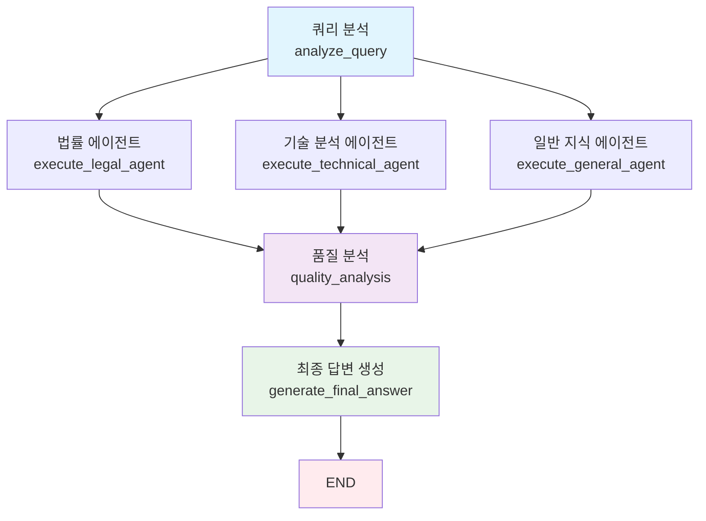

# 🚀 LangGraph 멀티 에이전트 시스템

이 프로젝트는 기존 멀티 에이전트 시스템을 **LangGraph**를 사용하여 더욱 체계적이고 확장 가능한 그래프 기반 워크플로우로 개선한 버전입니다.

## 🆕 LangGraph 버전의 주요 개선사항

### 🎯 핵심 장점
- **그래프 기반 워크플로우**: 복잡한 에이전트 간 상호작용을 체계적으로 관리
- **병렬 처리 최적화**: 모든 워커 에이전트가 동시에 실행되어 성능 향상
- **상태 기반 관리**: LangGraph의 AgentState로 전체 워크플로우 상태 추적
- **조건부 라우팅**: 상황에 따른 동적 워크플로우 제어
- **확장성**: 새로운 노드와 에이전트를 쉽게 추가 가능
- **오류 복구**: 개별 노드 실패 시 전체 시스템 안정성 유지

### 🏗️ 아키텍처 구조

```
📦 LangGraph 멀티 에이전트 시스템
├── 🧠 langgraph_agent_state.py      # 상태 관리 클래스
├── 🔧 langgraph_nodes.py            # 워크플로우 노드 함수들
├── 🌐 langgraph_multi_agent_system.py # 메인 시스템 (StateGraph)
├── 🚀 langgraph_main.py             # 실행 인터페이스
└── 🧪 test_langgraph_system.py      # 테스트 파일
```

## 📊 워크플로우 다이어그램



## 🛠️ 설치 및 설정

### 1. 새로운 의존성 설치

```bash
# LangGraph 패키지 설치
pip install langgraph>=0.3.0 langchain-core>=0.3.0

# 또는 requirements.txt 업데이트 후
pip install -r requirements.txt
```

### 2. 환경 변수 설정

기존 환경변수 설정을 그대로 사용:

```bash
# .env 파일
OPENAI_API_KEY=your_openai_api_key
ANTHROPIC_API_KEY=your_anthropic_api_key
GOOGLE_API_KEY=your_google_api_key
# ... 기타 설정들
```

## 🚀 사용법

### 1. 기본 실행

```bash
# LangGraph 시스템 실행
python langgraph_main.py
```

### 2. 실행 모드 선택

```
🚀 LangGraph 멀티 에이전트 시스템
==================================================

사용 가능한 모드:
1. 대화형 모드 (interactive)    # 실시간 대화
2. 배치 테스트 (batch)         # 여러 쿼리 동시 처리
3. 시스템 비교 (compare)       # 기존 시스템과 성능 비교
4. 단일 테스트 (single)        # 단일 쿼리 테스트

실행할 모드를 선택하세요 (1-4):
```

### 3. 프로그래밍 방식 사용

```python
import asyncio
from langgraph_multi_agent_system import LangGraphMultiAgentSystem

async def main():
    # 시스템 초기화
    system = LangGraphMultiAgentSystem()
    
    # 단일 쿼리 처리
    result = await system.process_user_query("금융소비자보호법이란 무엇인가요?")
    
    print(f"답변: {result['final_answer']}")
    print(f"성공: {result['success']}")
    print(f"실행 시간: {result['execution_time']:.2f}초")

asyncio.run(main())
```

### 4. 배치 처리

```python
# 여러 쿼리 동시 처리
queries = [
    "금융소비자보호법에 대해 설명해주세요",
    "대환대출이란 무엇인가요?",
    "금융감독원 신고 방법은?"
]

results = await system.batch_process_queries(queries)
for i, result in enumerate(results):
    print(f"쿼리 {i+1}: {'성공' if result['success'] else '실패'}")
```

## 🔧 시스템 구성 요소

### 1. AgentState (상태 관리)
```python
@dataclass
class AgentState:
    query: str                          # 사용자 쿼리
    legal_response: Dict[str, Any]      # 법률 에이전트 응답
    technical_response: Dict[str, Any]   # 기술 분석 응답
    general_response: Dict[str, Any]     # 일반 지식 응답
    quality_analysis: Dict[str, Any]     # 품질 분석 결과
    final_answer: str                   # 최종 답변
    # ... 기타 상태 필드들
```

### 2. 워크플로우 노드들

- **analyze_query**: 쿼리 복잡도 분석
- **execute_legal_agent**: 법률 전문 에이전트 실행
- **execute_technical_agent**: 기술 분석 에이전트 실행
- **execute_general_agent**: 일반 지식 에이전트 실행
- **quality_analysis**: 응답 품질 분석 및 선별
- **generate_final_answer**: 최종 답변 통합 생성

### 3. 병렬 실행 구조

```python
# 모든 에이전트가 동시에 실행됨
workflow.add_edge("analyze_query", "execute_legal_agent")
workflow.add_edge("analyze_query", "execute_technical_agent") 
workflow.add_edge("analyze_query", "execute_general_agent")

# 모든 에이전트 완료 후 품질 분석
workflow.add_edge("execute_legal_agent", "quality_analysis")
workflow.add_edge("execute_technical_agent", "quality_analysis")
workflow.add_edge("execute_general_agent", "quality_analysis")
```

## 📊 성능 비교

### 기존 시스템 vs LangGraph 시스템

| 항목 | 기존 시스템 | LangGraph 시스템 | 개선사항 |
|------|-------------|------------------|----------|
| **워크플로우 관리** | 수동 관리 | StateGraph 자동 관리 | ✅ 체계적 |
| **병렬 처리** | 제한적 | 완전 병렬 | ✅ 성능 향상 |
| **상태 추적** | 분산된 상태 | 중앙화된 AgentState | ✅ 일관성 |
| **확장성** | 코드 수정 필요 | 노드 추가만으로 확장 | ✅ 유연성 |
| **오류 처리** | 전체 시스템 영향 | 개별 노드 격리 | ✅ 안정성 |
| **디버깅** | 복잡함 | 각 노드별 추적 가능 | ✅ 편의성 |

## 🧪 테스트

### 1. 자동 테스트 실행

```bash
# pytest를 사용한 상세 테스트
pytest test_langgraph_system.py -v

# 성능 테스트만 실행
python test_langgraph_system.py
```

### 2. 테스트 항목

- ✅ 시스템 초기화
- ✅ 단일 쿼리 처리
- ✅ 복잡한 쿼리 처리
- ✅ 배치 처리
- ✅ 오류 처리
- ✅ 시스템 상태 확인
- ✅ 시스템 리셋

### 3. 성능 벤치마크

```bash
🚀 성능 테스트 시작...
✅ 쿼리 1: 8.45초
✅ 쿼리 2: 7.23초
✅ 쿼리 3: 9.12초
✅ 쿼리 4: 8.67초

🔄 배치 처리 성능 테스트...
📊 배치 결과: 4/4 성공
⏱️ 배치 시간: 12.34초
⚡ 평균 시간: 3.09초/쿼리
```

## 📈 모니터링 및 디버깅

### 1. 시스템 상태 확인

```python
# 시스템 상태 조회
status = system.get_system_status()
print(f"워크플로우 노드: {status['workflow_info']['nodes']}")
print(f"시스템 건강도: {status['system_health']}")
```

### 2. 워크플로우 추적

```python
# 각 노드별 실행 상태 로깅
[QueryAnalysis] 쿼리 분석 시작: 금융소비자보호법이란?
[QueryAnalysis] 분석 완료. 복잡도: 0.30
[LegalAgent] 법률 에이전트 실행 시작
[TechnicalAgent] 기술 분석 에이전트 실행 시작
[GeneralAgent] 일반 지식 에이전트 실행 시작
...
```

## 🔮 향후 확장 계획

### 1. 새로운 노드 추가
- **사전 검증 노드**: 쿼리 유효성 검사
- **후처리 노드**: 답변 포맷팅 및 검증
- **캐싱 노드**: 자주 묻는 질문 캐시

### 2. 고급 라우팅
```python
# 조건부 라우팅 예시
def route_based_on_complexity(state: AgentState):
    if state.complexity_score > 0.8:
        return "complex_processing"
    else:
        return "simple_processing"
```

### 3. 동적 에이전트 선택
- 쿼리 유형에 따른 에이전트 선택
- 에이전트 성능 기반 동적 라우팅

## 🤝 기여 방법

1. **새로운 노드 추가**: `langgraph_nodes.py`에 노드 함수 추가
2. **워크플로우 수정**: `langgraph_multi_agent_system.py`에서 엣지 수정
3. **상태 필드 추가**: `langgraph_agent_state.py`에 새 상태 필드 추가
4. **테스트 작성**: `test_langgraph_system.py`에 테스트 케이스 추가

## 📞 지원

- **문제 보고**: GitHub Issues에 문제 등록
- **기능 요청**: 새로운 기능 아이디어 제안
- **문서 개선**: README 및 주석 개선 제안

---

**LangGraph를 사용한 차세대 멀티 에이전트 시스템으로 더욱 강력하고 유연한 AI 서비스를 구축하세요! 🚀** 