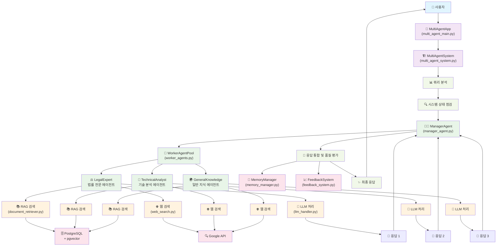

# AI agent
## 금융 소비자 권익 보호를 위한 AI agent
## 법 전처리 테스트시 "채권의 공정한 추심에 관한 법률.pdf"를 사용할 것을 권장합니다.
## postgresql에서 financedb에 접속
```bash
# 리눅스 환경에서 financedb 실행
sudo -u postgres psql financedb
```
```bash
# financedb렁 pgvector 연동
CREATE EXTENSION IF NOT EXISTS vector;
```
```bash
# 데이터베이스 테이블 구성 확인
\d 테이블명
# 테이블 종류 확인
\dt
```
# 멀티 AI agnet 전체 흐름도
3개의 전문 에이전트와 1개의 관리자 에이전트로 구성된 고도화된 AI agent 시스템

## 🏗️ 시스템 아키텍처


